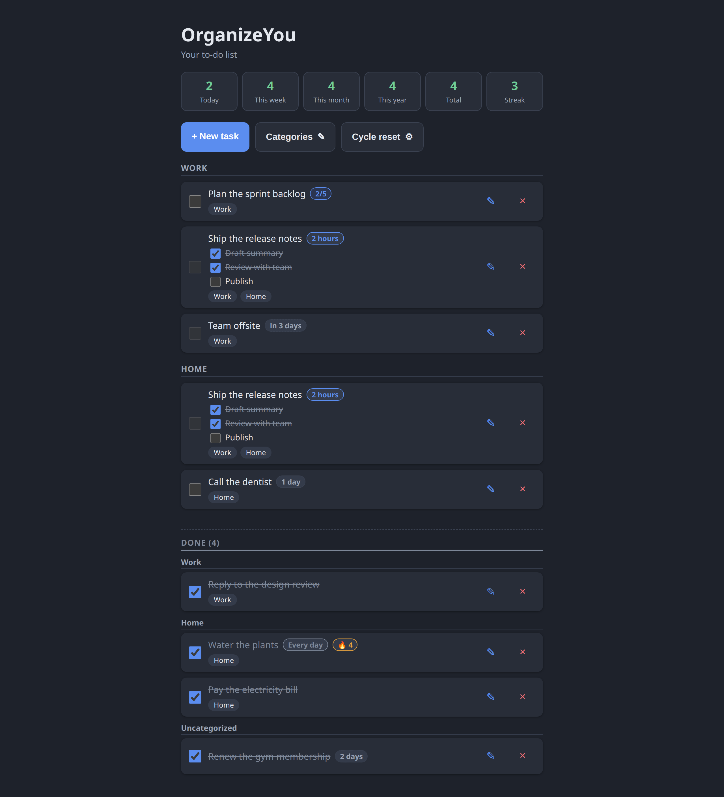
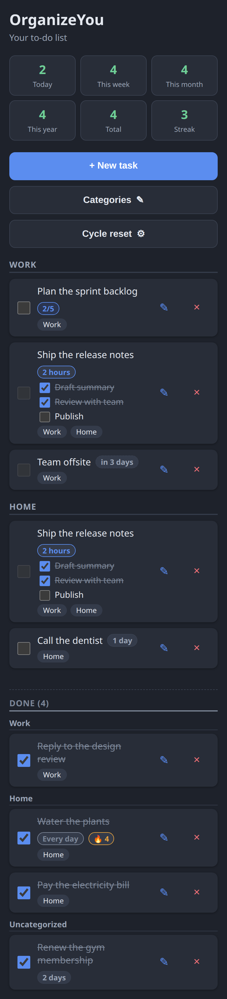
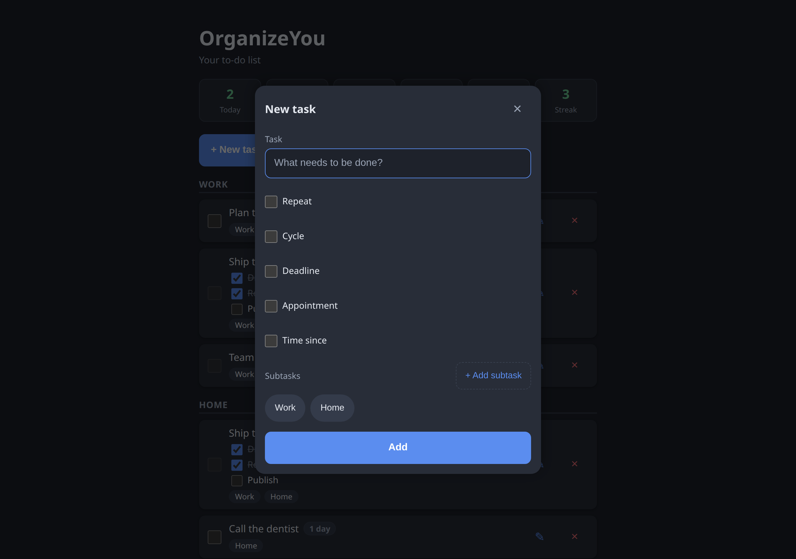

# OrganizeYou

[](https://github.com/SebaRomeroX/OrganizeYou/actions/workflows/ci.yml)
[](LICENSE)
[](https://sebaromerox.github.io/OrganizeYou/)

A to-do list that actually models how real work behaves: things repeat on **hours or
calendar cycles**, some can only be done **at a moment in time**, some count **up** since
you last did them, and consistency is worth measuring. Built with **plain HTML, CSS and
JavaScript — no framework, no build step, no runtime dependencies**. Everything lives in
your browser's `localStorage`.

**[Live demo](https://sebaromerox.github.io/OrganizeYou/)** ·
**[Roadmap](docs/ROADMAP.md)** · Runs fully offline · Data never leaves your device



## Features

- **Categories** – tag tasks with one or more categories; pending tasks are grouped by
  category and completed tasks collect in a **Done (N)** section at the end. A task with
  two tags appears in both sections (it moves as one unit).
- **Recurring cycles** – `Every N hours / days / weeks / months`.
  - Hours are _true elapsed time_ (`+2h` is +2h of real time, DST-proof).
  - Day/week/month are _calendar-aligned_ to a configurable anchor: start time
    (e.g. 06:00), week start day, month start day and month anchor (for `N > 1` the
    periods phase to the epoch, so a "every 3 months" task stays on Jan/Apr/Jul/Oct).
  - Completing a cycle resets progress and shows a **cycle badge**; a per-task
    **streak** counts completed cycles in a row (fire badge).
- **Counters and subtasks** – `2/5` counters and/or a checklist per task; ticking
  subtasks feeds the counter. A task completes when its counter is full or every
  subtask is ticked.
- **Deadlines** – `YYYY-MM-DD` counts to the end of that day ("today", "3 days"),
  timed deadlines count days → hours → 10-minute steps with urgent/overdue states.
- **Appointments** – a moment when the task _unlocks_: the checkbox stays disabled
  until then, the badge counts up ("in 3 days" → "in 1 hour" → "in 10 min" → "now").
  Once the moment passes it reads **now** and never nag "overdue".
- **Time since** – a count-up badge from the last time you did something
  ("20 min" → "3 hours" → "2 days" → "1 week" → "2 months").
- **Stats strip** – completions today / this week / this month / this year / total,
  plus your current **day streak** (consecutive days with at least one completion).
- **Settings modal** – change the cycle anchor and every cycled task re-syncs.
- Dark, responsive UI (tested down to 390 px), `aria-label`ed controls, keyboard-usable
  modal with focus trap, Escape-to-close and focus restore.

| Mobile                                               | New task dialog                               |
| ---------------------------------------------------- | --------------------------------------------- |
|  |  |

## Why no framework?

This project deliberately uses the platform: native ES modules, DOM APIs and
`localStorage`. For an app of this size that buys a lot:

- **Zero dependencies and zero build step** – clone it, serve it, read it. Nothing to
  audit, nothing that breaks when a toolchain moves on.
- **The interesting logic is pure functions, not framework machinery** – cycle math,
  badge ladders and counters are plain functions over dates and data (see below), so
  they are unit-tested without mounting anything.
- **The code is the portfolio** – each module is a small, single-purpose file a
  reviewer can hold in their head, not the glue between libraries.

The trade-offs of this choice and the review that shaped the current structure are
tracked honestly in `improvementPlan.txt`.

## Quick start

```bash
git clone https://github.com/SebaRomeroX/OrganizeYou.git
cd OrganizeYou
npx serve .                 # or: python3 -m http.server
```

Then visit <http://localhost:3000> (or :8000 for Python). No install, no build. Your
data stays in `localStorage` for that origin.

> The app is a native ES module (`<script type="module">`), so it needs an HTTP origin —
> opening `index.html` via `file://` is blocked by the browser's module CORS rules. Any
> static server does; the [live demo](https://sebaromerox.github.io/OrganizeYou/) needs
> nothing at all.

## Architecture

```
index.html   markup + the single module entry (<script type="module" src="app.js">)
styles.css   all styling (dark theme, responsive)
state.js     the shared store, constants and lookups (imports nothing)
storage.js   localStorage keys, defensive loaders, saves, hydrate()
logic.js     pure logic: cycle math, badge ladders, counters, streaks
cycles.js    the cycle engine (reset/backfill/sync); render-free by design
badges.js    60s in-place badge refreshers + checkbox state
render.js    rendering + the commands that re-render
modals.js    dialog orchestration (mode builder, tag chips, settings)
modal.js     the reusable dialog component (focus trap, Escape, focus restore)
app.js       entry: hydrate, wire buttons, startup sequence, ticker
tests/       node:test suites for logic.js (zero dependencies)
docs/        screenshots, social preview image and ROADMAP.md
```

The import graph is acyclic and documented in `state.js`; `app.js` is the only module
that touches everyone. `logic.js` is a native ES module shared by the page and the
tests: it holds the pure part of the app (no DOM, no storage) — `nextCycleBoundary`,
`countdownInfo`, `appointmentInfo`, `sinceInfo`, `doneCounts`, `dayStreak`,
`streakOnBoundary`, anchor normalization — so the exact code that runs in the browser
is the code under test.

## Tests

```bash
npm test        # node --test, no packages to install
npm run lint    # eslint (dev-only dependency)
```

79 tests in 7 files, covering the behaviors the roadmap committed to:

- **cycles** – hour math is true elapsed time across DST (spring-forward and
  fall-back), calendar boundaries land on the configured anchor, `N > 1` epoch
  phasing, strictly-after at an exact boundary, garbage-input clamping;
- **countdown / appointment / since** – every ladder step, exact boundaries
  (24 h, 10-minute floor, 7 days, 30 days), sticky "now", invalid input;
- **stats** – week bucket honors the anchor's `weekStartDay`, midnight rollover,
  day-streak rules (including "today isn't dead until the day ends");
- **boundaries / counters** – table-driven suites: DST transitions for day/week/month
  (asserting true elapsed hours, not just wall clock), all seven `weekStartDay`
  values, streak gap tables, anchor variants.

CI runs lint, `prettier --check` and the tests on Node 20 and 22 for every push and
pull request.

## How this project evolved

The full build log lives in
**[docs/ROADMAP.md](docs/ROADMAP.md)**: fourteen goals, each with its decisions,
edge cases, adjustments discovered on the way, and a dated changelog.

The process is visible in the commit history too — every goal follows the same
discipline: _define the goal_ → _build it_ → _mark it reviewed and committed_.
Browse the [commit history](https://github.com/SebaRomeroX/OrganizeYou/commits/main)
to see that narrative play out goal by goal.

[`improvementPlan.txt`](improvementPlan.txt) records the portfolio review that
shaped the current structure (README, screenshots, license, module split, tests,
CI, robustness) — findings, plan, corrections found while executing, and grades.

## What's next

- Optional: sync across devices, PWA offline install

## License

[MIT](LICENSE)
